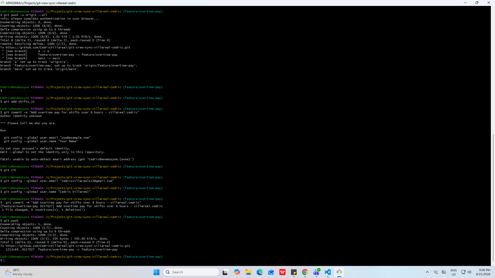
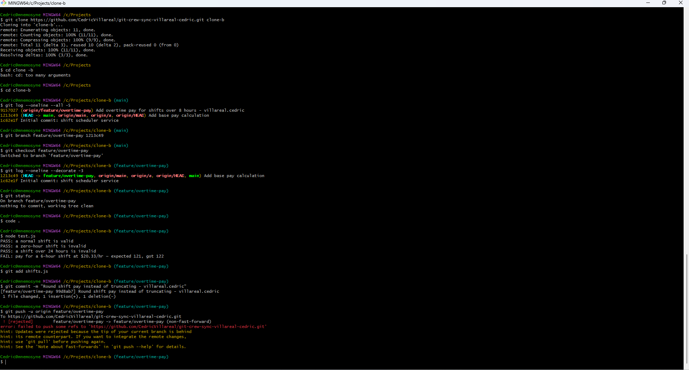
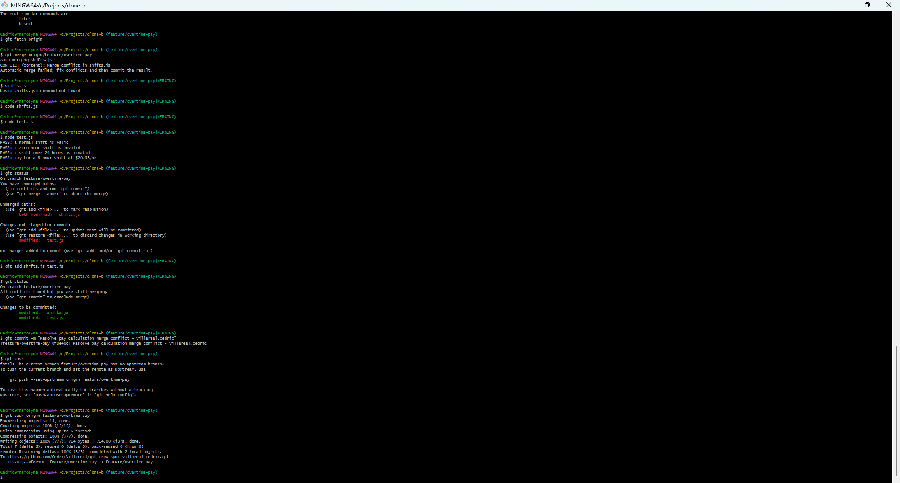
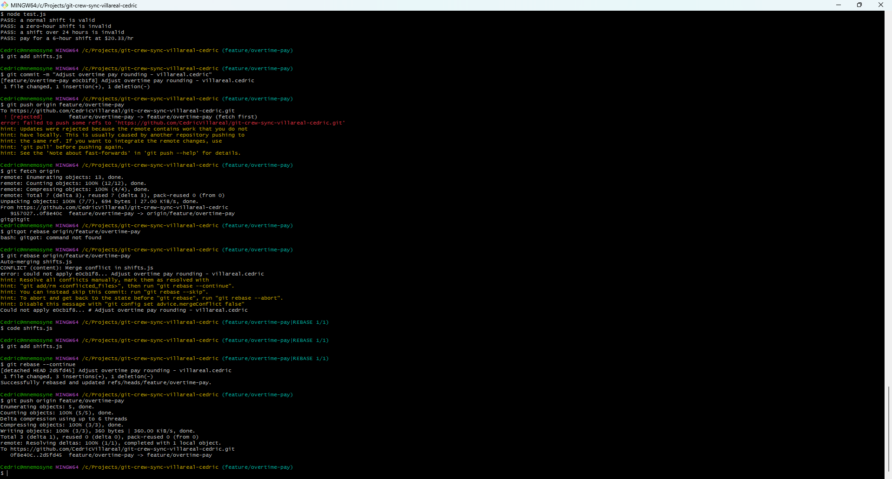
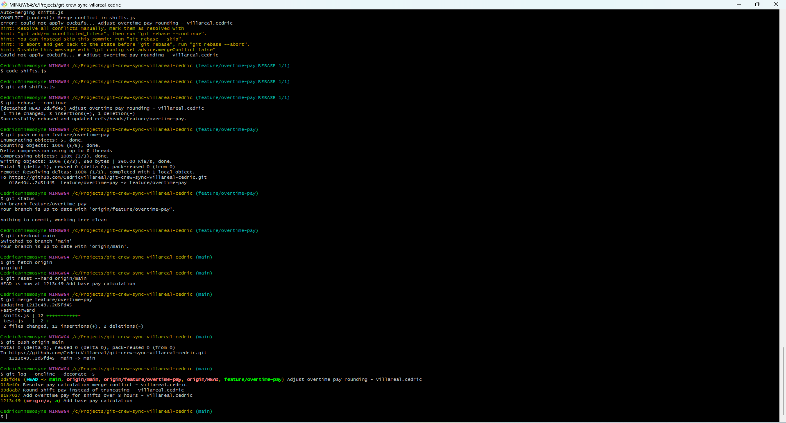

# Git Crew Sync Workflow

## Task 1 — Clone A: Overtime Pay

Clone A added overtime pay for hours worked beyond 8 hours at a 1.5× rate.

## Task 2 — Clone B: Rejected Push

Clone B changed `calculatePay()` to use rounding instead of truncation. The push was rejected because the remote feature branch contained commits that were not present in the local branch.

## Task 3 — Merge Conflict

Clone B fetched the remote changes and merged them into the local feature branch. A conflict occurred in `shifts.js` because both branches modified `calculatePay()`. The conflict was resolved by keeping both the overtime calculation and rounding behavior.

## Task 4 — Rebase Conflict

Clone A made another change to `calculatePay()` and attempted to push without first fetching the remote changes. The push was rejected. After fetching, the local branch was rebased onto the updated remote feature branch and the conflict was resolved.

## Task 5 — Merge Feature into Main

The completed `feature/overtime-pay` branch was merged into `main` and pushed to GitHub.

## Questions

### 1. What did the rejected push error say, and why?

The push was rejected because the remote branch contained commits that were not present in the local branch. Git prevented the push because the update would not be a fast-forward.

### 2. What is the difference between the Task 3 merge and Task 4 rebase?

In Task 3, the remote changes were merged into the local branch, preserving the branch histories and creating a merge commit.

In Task 4, the local commit was replayed on top of the updated remote branch using rebase, resulting in a more linear history.

### 3. What is one habit that would avoid both rejected pushes?

Before pushing, fetch the latest changes from the remote repository and check whether the local branch is behind the remote branch.

### 4. Which approach would you default to on a shared team branch, merge or rebase, and why?

I would default to merge on a shared team branch because it preserves the history of how branches were integrated and avoids rewriting commits that other team members may already have.